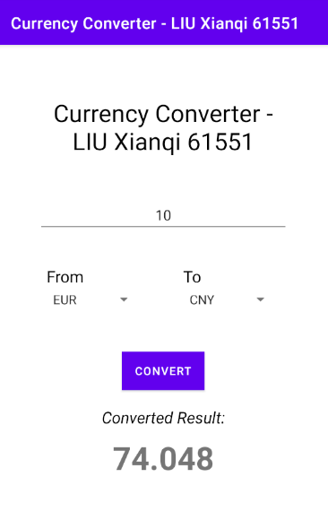

# currencyconverter-kyleliuxianqi
Assignment 4 - Currency Converter
by LIU Xianqi 61551

Due to the ExchangeRates API that is suggested in class ask me to pay, otherwise 
I can't use lots of features like HTTPS, the endpoints for only using currency code 
and amount to get the conversion, etc.
Thus, I find another API which is totally free, which is https://www.frankfurter.app/.
It also tracks foreign exchange references rates published by the European Central Bank. 
You will explore details in its official documents.

I mainly use these two following two endpoints:
1.Gets a list of available currency symbols along with their full names.
The data I fetch here is used for adding the currency code items to the spinner.

> https://api.frankfurter.app/currencies 

2.Convert any value between currencies using this endpoint in combination with the amount parameter.
Below, we convert 10 British Pounds to US Dollars.

> https://api.frankfurter.app/latest?amount=10&from=GBP&to=USD

As for the HTTP request, I use OKHttp, which is an efficient HTTP & HTTP/2 client for Android and Java applications.

Overview of my assignment:

